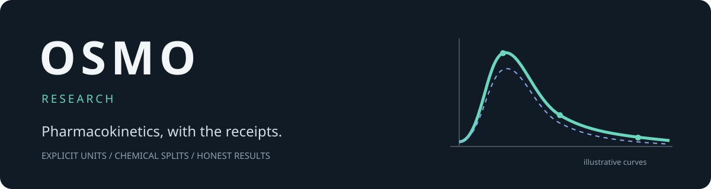
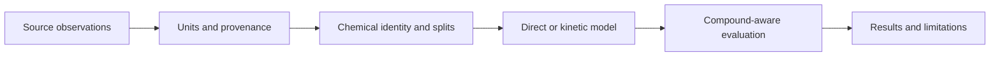

<p align="center"></p>

<p align="center">
  <a href="LICENSE"></a>
  
  
</p>

<p align="center"><strong>What survives when the model doesn't meet the target?</strong><br/>Useful code. Reproducible checks. Results worth sharing.</p>

OSMO started with an ambitious question: could molecular structure, formulation and dose predict drug concentrations over time? The experiments did **not** establish the intended 70%-within-twofold human-organ accuracy. This repository shares the engineering that came out of the investigation—and the limitations, too.

## What you can use

- **Chemistry-aware splits.** Group related structures and reserve connected chemical families across auxiliary datasets.
- **Unit-explicit data adapters.** Keep brain `ng/g` separate from plasma `ng/mL`, and absolute doses separate from `mg/kg`.
- **Differentiable kinetics.** Explore one-, two- and three-compartment models, infusion, oral absorption and an experimental saturable-transfer decoder.
- **Fairer evaluation.** Aggregate within-twofold hits over curves, compounds and tissues so a densely sampled curve cannot dominate the score.
- **Observed-data extraction.** Read supported legacy PK-Sim project arrays without executing general .NET object deserialization.
- **Regression tests.** Check mass conservation, gradients, independent ODE agreement, chemical reservations, censoring and metric boundaries.

## Try it in a minute

```bash
git clone https://github.com/shlbi/osmo.git
cd osmo
python -m venv .venv
# macOS/Linux:
source .venv/bin/activate
# Windows PowerShell: .venv\Scripts\Activate.ps1
python -m pip install -e ".[test]"
python examples/synthetic_demo.py
python -m pytest -q
```

The demo runs locally on CPU, requires no account or external dataset, and checks a mass-conserving model using **synthetic** inputs. It writes a curve CSV and a small JSON summary into `demo-output/`. Synthetic curves are never represented as observed data or scientific accuracy evidence. PyTorch installation may take a few minutes.

## The pipeline



## What happened in the experiments?

On the matched, reduced **rat-plasma development cohort**, a transfer-compatible direct model averaged **26.27% within twofold** with an auxiliary-pretrained encoder versus **24.32%** from scratch across three fine-tuning seeds. The matched hybrid experiment scored **14.54% versus 14.12%**. Both used 11 training compounds and four validation compounds. These are small development experiments, not independent test results or human-organ predictions.

The separate 18-task auxiliary experiment scored **42.60%** for the shared encoder and **42.30%** for ExtraTrees, averaged across tasks. Those tasks predict scalar PK/ADME properties, not concentration curves. These percentages cannot be substituted for organ accuracy.

**The takeaway:** more auxiliary data and a more physiological decoder did not solve generalization in this setting. Negative results belong in the record. See [experiment notes](docs/experiments.md) and the [aggregate results](results/).

## Explore the code

```text
src/osmo/
  chemistry.py       molecular identities and chemical clusters
  auxiliary.py       cross-dataset chemical reservations
  data_units.py      explicit unit conversion
  expanded.py        expanded observation adapters
  mechanistic.py     absorption, infusion and mass balance
  architectures.py   direct and compartmental research decoders
  metrics.py         macro evaluation and cluster bootstrap
  osp_binary.py      supported legacy observed-array extraction
tests/               independent numerical and data-integrity checks
examples/            self-contained synthetic demonstration
scripts/             dataset-dependent research workflows
```

For your own data, start with [data requirements](docs/data.md). The research scripts need prepared inputs; the published CSV summaries are not sufficient to reproduce historical training. Raw datasets, subject-level observations, private working files and trained weights are not bundled.

## Scope and limitations

This is a research toolkit, **not validated clinical software**. Latent compartments are not automatically anatomical organs. Drug-specific plasma prediction does not establish brain or human-tissue accuracy. Chemistry splits help control leakage; they do not eliminate every source bias or guarantee prospective performance.

The legacy binary reader supports a narrow format and is not a sandbox for arbitrary files. Use trusted local inputs. Source preparation and scientific review remain necessary before training.

## Contributing

Useful contributions include independently checked units, clearer dataset contracts, public reproducible benchmarks, stronger tests, and well-controlled negative results. Please include source provenance and distinguish observed measurements from fitted or simulated values. See [CONTRIBUTING.md](CONTRIBUTING.md).

## License and acknowledgments

Original OSMO code and documentation are released under the **[MIT License](LICENSE)**. External datasets, upstream software and dependencies retain their own licenses; MIT does not relicense them. See [THIRD_PARTY.md](THIRD_PARTY.md).

Built with Python, PyTorch, RDKit, NumPy, SciPy, pandas and scikit-learn. The research benefited from publicly documented resources including EPA CvTdb, Open Systems Pharmacology, ChEMBL, PKSmart and Dryad.

<p align="center"><sub>Built to investigate. Shared so others can inspect, reproduce and improve.</sub></p>
